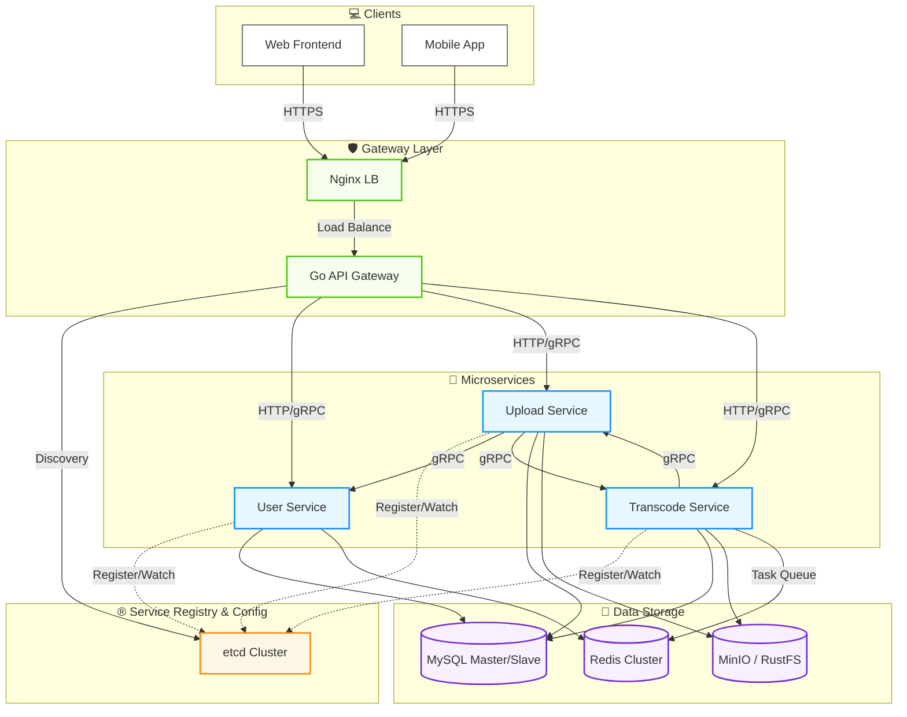

# Go Video Platform

这是一个基于 Go 语言生态构建的现代化视频平台示例项目，采用微服务架构 + DDD（领域驱动设计）思想。项目实现了从用户注册登录、视频分片上传、断点续传、到后台异步转码处理及前端播放的完整业务链路，已在 k3s + ACR + RustFS 环境跑通。

## ✨ 功能特性

- **微服务架构**：基于 DDD 设计的三个核心后端服务（用户、上传、转码），职责清晰。
- **高性能上传**：支持大文件分片上传、断点续传、秒传，结合 MinIO / RustFS 对象存储。
- **视频处理**：内置 FFmpeg 转码工作流，支持多分辨率转码（可降级为模拟模式），**默认生成 HLS (m3u8) 切片**，实现流畅的流媒体播放体验。
- **服务治理**：支持 etcd 注册发现，也可直接用 K8s Service DNS/直连模式；gRPC 实现高性能服务间通信。
- **安全机制**：基于 JWT 的用户认证，API 网关统一鉴权。
- **现代化前端**：使用 React 18 + Vite + Ant Design 构建的响应式 Web 界面，**仿 Bilibili 风格设计**。
- **社交互动**：用户关注系统，支持关注/取消关注、粉丝统计、个人主页展示。

## 🗺️ 产品规划 (Roadmap)

### ✅ 已完成
- [x] 用户注册与登录 (JWT)
- [x] 视频分片上传与断点续传
- [x] 视频转码 (MP4 -> HLS/m3u8)
- [x] 首页视频列表展示 (Bilibili 风格)
- [x] 视频播放器 (支持 HLS)
- [x] K8s 部署（k3s + ACR + RustFS，NodePort 对外）
- [x] Kong 声明式网关（RS256 JWT 校验）
- [x] **用户关注/粉丝系统**
  - [x] 关注/取消关注功能
  - [x] 粉丝数/关注数统计
  - [x] 用户个人主页
  - [x] 关注状态实时同步

### 🚧 待开发 (Coming Soon)
- [ ] **增强鉴权**：完善的 RBAC 权限控制，支持 OAuth2 第三方登录。
- [ ] **社交互动增强**：
    - [ ] 视频评论与回复
    - [ ] 视频点赞、投币、收藏
    - [ ] 关注列表与粉丝列表页面
- [ ] **内容创作**：
    - [ ] 视频发布草稿箱功能
    - [ ] 创作者中心（数据看板）
- [ ] **观测与弹性**：Prometheus/Grafana 指标、链路追踪、自动扩缩容策略。

## 🏗 系统架构



### 服务职责
- **Kong 网关 (HTTP 8000 / Admin 8001)**: 统一流量入口，负责路由转发、CORS 处理、JWT 鉴权。
- **User Service (HTTP 8081 / gRPC 9091)**: 用户注册、登录、个人信息管理、**用户关注/粉丝系统**。
- **Upload Service (HTTP 8082 / gRPC 9094)**: 视频分片上传、合并、元数据发布（视频发布逻辑在此服务中）。
- **Transcode Service (HTTP 8083 / gRPC 9092)**: 异步视频转码任务调度与执行，生成 HLS 切片并回传播放地址。

## 🔎 链路追踪与日志 ID
- 网关：Kong 启用 `request-id` 插件，入口统一生成/回显 `X-Request-ID`，并透传到下游。
- HTTP：各服务的 Gin 中间件将 `X-Request-ID` 注入请求上下文和响应头；访问日志中间件默认打印 `request_id`。
- gRPC：客户端、服务端均使用拦截器自动把 `request_id` 写入 gRPC metadata 并回传 header，业务日志可通过 `logger.WithContext(ctx)` 自动携带 `request_id/user_uuid`。
- 业务代码：凡有 `context.Context` 的入口，推荐使用 `logger.WithContext(ctx).Infof/Warnf/Errorf` 打印，保持日志链路一致。

## 📊 日志收集（Loki + Promtail + Grafana）

### 日志格式与输出
- 所有 Go 服务使用各自的 `pkg/logger` 输出 **JSON 结构化日志**，字段包括：`timestamp`、`level`、`message`、`file`、`line`、`fields`（内含 `request_id/user_uuid` 等）。
- 配置文件中统一设置：
  ```yaml
  log:
    level: info
    format: json
    output: stdout   # 必须是 stdout，方便 K8s 采集
  ```
- 在 K8s 环境下，容器日志通过 Kubelet 落到节点 `/var/log/pods/<namespace>_<pod>_<uid>/<container>/0.log`。
- 所有后端、网关容器的时区均设置为 `Asia/Shanghai`（Dockerfile 内安装 `tzdata` + K8s Deployment 中注入 `TZ=Asia/Shanghai`），保证日志时间与北京时间一致。

### K8s 环境日志采集链路
整体链路：**服务 stdout → 节点 /var/log/pods → Promtail DaemonSet → Loki → Grafana Loki 数据源**。

1. **部署监控命名空间与 Loki/Promtail**
   ```bash
   # 1）创建 observability 命名空间
   kubectl apply -f k8s/observability/namespace.yaml

   # 2）部署 Loki（日志存储）
   kubectl apply -f k8s/observability/loki.yaml

   # 3）部署 Promtail（日志采集）
   kubectl apply -f k8s/observability/promtail.yaml
   ```
   - Promtail 以 DaemonSet 形式运行，每个节点挂载 `/var/log/pods`，只采集 `go-video` 命名空间下的 Pod 日志。
   - 配置中已经内置了静态采集规则，分别跟踪：
     - `user-service`：`/var/log/pods/go-video_user-service-*/user-service/0.log`
     - `upload-service`：`/var/log/pods/go-video_upload-service-*/upload-service/0.log`
     - `video-service`：`/var/log/pods/go-video_video-service-*/video-service/0.log`
     - `transcode-service`：`/var/log/pods/go-video_transcode-service-*/transcode-service/0.log`
     - `gateway(kong)`：`/var/log/pods/go-video_gateway-*/kong/0.log`

2. **部署 Grafana 并配置 Loki 数据源**
   ```bash
   # 4）安装 kube-prometheus-stack（包含 Grafana/Prometheus），release 名约定为 kps
   # 示例（请根据实际情况调整）:
   # helm install kps prometheus-community/kube-prometheus-stack -n observability

   # 5）为 Grafana 注入 Loki 数据源 & 暴露 NodePort
   kubectl apply -f k8s/observability/grafana-datasource-loki.yaml
   kubectl apply -f k8s/observability/grafana-nodeport.yaml
   ```
   - Grafana 通过 ConfigMap `loki-datasource` 自动挂载 Loki 数据源，地址为 `http://loki.observability.svc:3100`。
   - `kps-grafana-nodeport` 对外暴露在 NodePort `30030`，可通过 `http://<任意节点IP>:30030` 访问 Grafana，也可使用 `kubectl port-forward` 在本地访问。

3. **在 Grafana 中查看日志**
   - 在浏览器访问 Grafana 后：
     1. 进入左侧 **Explore**，数据源选择 `Loki`；
     2. 右上角时区建议选择 `Browser time`，时间范围可选 `Last 1 hour` 或更长；
     3. 常用 LogQL 查询示例：
        ```logql
        {namespace="go-video"}                             # 查看 go-video 下所有服务日志
        {namespace="go-video", app="upload-service"}       # 只看上传服务
        {job="manual-go-video-user"}                       # 静态 job 采集的 user-service 日志
        {namespace="go-video"} |= "http request" | json    # 解析 JSON 后过滤 HTTP 请求日志
        ```
     4. 通过 `request_id` 追踪链路：
        - 从前端或网关获取某次请求的 `X-Request-ID`；
        - 在 Loki 中查询：`{namespace="go-video"} |= "<request-id>" | json`，即可串起同一请求在各服务中的日志。

## 🧭 架构/重构方向（转码任务与调度）
- 抽象 Task/Runner：为 Kafka 消费、未来定时任务/延迟队列提供统一的 `TaskHandler` + `TaskRunner`，Runner 负责并发/背压/重试/提交策略；Handler 只关注用例逻辑。
- Application Command Handler：用命令处理器包装转码创建/更新，Kafka/HTTP/定时触发共用同一入口，避免适配层越界直连仓储。
- 生命周期统一：通过组件管理器注册 Runner，应用启动/退出时统一 Start/Stop，便于“一键启动”所有消费者/定时任务。
- 观测性：Runner 层记录 `request_id/task_uuid/offset` 等字段日志，并暴露消费速率、失败率、滞后等指标；业务层继续使用 `logger.WithContext(ctx)`。
- 背压/幂等：在 Runner 内集中处理背压与重试，Handler 内处理基于 `task_uuid/job_uuid` 的幂等与校验，减少散落的 sleep/commit 逻辑。

## 🛠 技术栈

- **后端**: Go 1.24+ (Gin, gRPC, GORM, Viper, Wire)
- **数据库/缓存**: MySQL 8.0, Redis 7.0
- **对象存储**: MinIO / RustFS (高性能分布式文件系统)
- **服务发现**: etcd
- **视频工具**: FFmpeg
- **前端**: React 18, TypeScript, Vite, Ant Design

## 🚀 快速开始

### 1. 环境准备
确保本地已安装以下工具：
- Go 1.24+
- Node.js 18+ & pnpm/npm
- Docker & Docker Compose (推荐用于启动基础设施)
- FFmpeg (可选，若未安装转码服务将运行在模拟模式)

### 2. 启动基础设施
使用 Docker 快速启动 MySQL, Redis, MinIO/RustFS, etcd：
```bash
# 假设你已有相关的 docker-compose.yml，或者手动启动这些容器
# 示例 etcd 启动命令:
docker run -d --name etcd -p 2379:2379 \
  -e ALLOW_NONE_AUTHENTICATION=yes \
  -e ETCD_ADVERTISE_CLIENT_URLS=http://0.0.0.0:2379 \
  -e ETCD_LISTEN_CLIENT_URLS=http://0.0.0.0:2379 \
  quay.io/coreos/etcd
```

### 3. 初始化数据库
执行初始化脚本创建数据库和表结构：
```bash
mysql -h 127.0.0.1 -P 3306 -u root -p < scripts/mysql/init_all.sql
```
> **注意**: 脚本会创建 `user_service`, `upload_service`, `transcode_service` 等数据库。
> - `upload_service` 库包含了视频发布相关的 `video_publish` 表
> - `user_service` 库包含 `user` 表（需添加 nickname, description, cover_url 字段）和 `user_follow` 表（用于关注系统）

### 4. 配置文件
复制并修改配置文件（参考 `configs/config.dev.yaml`）：
- 确保数据库、Redis、MinIO/RustFS 的连接信息正确。
- **关键配置**：确保存储服务 (MinIO 或 RustFS) 中存在 `uploads` 和 `transcode` 桶（Bucket）。
    - `uploads`: 用于存储原始上传分片、合并后的成片以及 HLS 切片。
    - `transcode`: (可选) 用于存储中间产物或其他转码资源。
> 提示：仓库中的直传与合并逻辑默认使用桶名 `uploads`（复数）。如使用 Helm 安装 MinIO，请确保创建该桶。

### 5. 启动后端服务
建议在不同的终端窗口中分别启动：

**Gateway Service**
```bash
cd gateway-service
go mod tidy
go run main.go
```

**User Service**
```bash
cd user-service
go mod tidy
go run main.go
```

**Upload Service**
```bash
cd upload-service
go mod tidy
go run main.go
```

**Transcode Service**
```bash
cd transcode-service
go mod tidy
go run main.go
```

### 6. 启动前端
```bash
cd frontend
npm install
npm run dev
```
访问 `http://localhost:5173` 开始体验。

### 7. 构建 Docker 镜像（本地/K8s）
在仓库根目录执行，确保能访问到 `proto/` 与各服务源码：
```bash
# 用户服务镜像
docker build -f user-service/Dockerfile -t go-video/user-service:dev .

# 上传服务镜像
docker build -f upload-service/Dockerfile -t go-video/upload-service:dev .

# 转码服务镜像（如需）
docker build -f transcode-service/Dockerfile -t go-video/transcode-service:dev .
```

### 8. 运行容器（示例）
假设 MySQL/Redis 在宿主机，可用 `host.docker.internal` 访问；密钥以挂载方式提供：
```bash
# 用户服务
docker rm -f user-service 2>/dev/null
docker run -d --name user-service \
  -p 8081:8081 \
  -v "$(pwd)/user-service/configs/config.dev.yaml:/app/configs/config.dev.yaml" \
  -v "$(pwd)/private.pem:/app/certs/private.pem" \
  -v "$(pwd)/public.pem:/app/certs/public.pem" \
  -e CONFIG_PATH=/app/configs/config.dev.yaml \
  -e GO_VIDEO_JWT_RSA_PRIVATE_KEY_PATH=/app/certs/private.pem \
  -e GO_VIDEO_JWT_RSA_PUBLIC_KEY_PATH=/app/certs/public.pem \
  go-video/user-service:dev

# 上传服务
docker rm -f upload-service 2>/dev/null
docker run -d --name upload-service \
  -p 8082:8082 \
  -p 9094:9094 \
  -v "$(pwd)/upload-service/configs/config.dev.yaml:/app/configs/config.dev.yaml" \
  -e CONFIG_PATH=/app/configs/config.dev.yaml \
  go-video/upload-service:dev
```
若依赖运行在其他容器，请将配置中的 host 改为对应容器名并放到同一网络；启动失败时用 `docker logs <name>` 排查。

### 📦 不使用 etcd 的本地 / 云端直连部署
- 在三个服务的配置中将 `etcd.endpoints` 置空，`service_registry.enabled`（以及 upload-service 的 `grpc_service_registry.enabled`）设为 `false`。
- 为依赖服务填好直连地址：`upload-service` -> `dependencies.user_service.address=host:9091`、`dependencies.transcode_service.address=host:9092`；`transcode-service` -> `dependencies.upload_service.address=host:9093`。在 K8s 中可直接使用 Service DNS，如 `user-service:9091`。
- 仍可在有 etcd 的环境下开启注册发现，保持兼容。

### ☁️ 线上部署要点（k3s + ACR + RustFS 示例）
- 镜像：使用 `build_push.sh` 构建并推送到 ACR（可指定 TAG）；部署时 `set image` 切换后 `rollout restart`。
- 存储：MySQL、Redis、RustFS 在集群内；对象存储需先建好 `uploads` 桶。
- 证书与 JWT：`jwt-keypair` Secret 挂载到 `/app/certs`，`CONFIG_PATH=/app/configs/config.dev.yaml`；User Service 使用 RS256（需确保网关公钥与之匹配）。
- 网关：Kong 声明式配置，Upstream 走 K8s Service DNS；对外使用 NodePort 暴露：`30080` (gateway 8000)、`30081` (gateway admin 8001)。
- 前端：`frontend` 通过 NodePort `30000` 暴露（服务端口 80），访问 `http://<节点IP>:30000`；Nginx 配置已包含 SPA 回退与 `/api`、`/uploads`、`/storage` 反代到网关。

## 🔌 K8s 一键部署与暴露
- 在 `k8s/deploy.sh` 中包含 MySQL/Redis/Kafka/MinIO 的安装与等待逻辑。部署前确保集群可用并安装了 `helm`。
- 默认 MinIO `defaultBuckets` 配置可能为 `upload,transcode`。为兼容本项目的直传逻辑，请创建 `uploads` 桶：
  - 端口转发：`kubectl -n go-video port-forward svc/rustfs 9000:9000`
  - 创建桶：
    - 使用 `mc`：`mc alias set rustfs http://localhost:9000 <ACCESS> <SECRET>`，`mc mb rustfs/uploads`
    - 或使用 AWS CLI：`aws --endpoint-url http://<节点IP>:30080 s3 mb s3://uploads`
- 暴露端口（NodePort）：
  - 前端：`30000 -> 80`，浏览器访问 `http://<节点IP>:30000`
  - 网关：`30080 -> 8000`，对外统一入口 `http://<节点IP>:30080`
  - 网关管理：`30081 -> 8001`

## 📤 分片直传流程与常见排错
- 直传路径：上传服务生成 S3 预签名 URL（SigV4），形如：
  `http://<节点IP>:30000/uploads/chunks/YYYY/MM/DD/<upload_video_uuid>/chunk_<index>?X-Amz-*`
- 代理链路：浏览器 `PUT` 请求 → 前端 Nginx `/uploads` → Kong（`preserve_host: true`）→ MinIO/RustFS 9000。
- 必须使用 `PUT` 方法并保留原始 `Host` 头用于签名校验。
- 常见 405/403/404 原因：
  - 桶不存在：请确保创建 `uploads` 桶。
  - 代理方法限制：确认前端与 Kong 路由均允许 `PUT/DELETE/OPTIONS`（参见 `k8s/frontend-nginx-config.yaml` 与 `k8s/gateway-kong-config.yaml`）。
  - 本地代理干扰：浏览器或系统代理可能拦截 `PUT`（DevTools 显示 `Remote Address 127.0.0.1:7890`），请关闭或对该域名直连。
  - 使用了 `http` 而非 `https` 时的跨域/安全策略：如需公网与生产环境，建议在网关层开启 TLS。

## 🔑 端点与路径约定
- 前端：`/`、`/upload` 页面等，走 `http://<节点IP>:30000`
- 网关：统一入口 `http://<节点IP>:30080`
  - 业务 API：`/api/...` → 后端服务（Upload/User/Video）
  - 存储读写：
    - `/storage`（strip_path=true）：`/storage/<bucket>/<key>` → MinIO 9000
    - `/uploads`（strip_path=false）：直传分片与合并路径，不裁剪前缀


## 📚 文档

- **功能文档**
  - [用户关注系统](./docs/features/user-follow-system.md) - 关注功能的完整说明与技术实现
- **API 文档**
  - [用户关注 API](./docs/api/user-follow-api.md) - 关注相关接口的详细文档
- **数据库迁移**
  - [用户关注系统迁移脚本](./scripts/mysql/migration_user_follow.sql) - 数据库初始化SQL

## 📂 目录结构

```text
.
├── configs/                # 全局配置示例
├── frontend/               # React 前端项目
├── gateway-service/        # API 网关
├── upload-service/         # 上传与视频发布服务
├── user-service/           # 用户服务
├── transcode-service/      # 转码服务
├── proto/                  # gRPC Protobuf 定义
├── scripts/                # 数据库初始化脚本等
└── README.md               # 项目文档
```

## 📝 注意事项
- **Go 版本**: 项目使用了 Go 1.24 的新特性，请确保本地 Go 版本符合要求。
- **FFmpeg**: 转码服务会检查本地是否安装 `ffmpeg`。如果未安装，会自动降级为"模拟转码"模式（仅复制文件并重命名），方便非生产环境开发。
- **服务依赖**: 启动顺序建议为：基础设施 -> User/Upload/Transcode -> Gateway -> Frontend。

## 🤝 贡献
欢迎提交 Issue 和 Pull Request！
