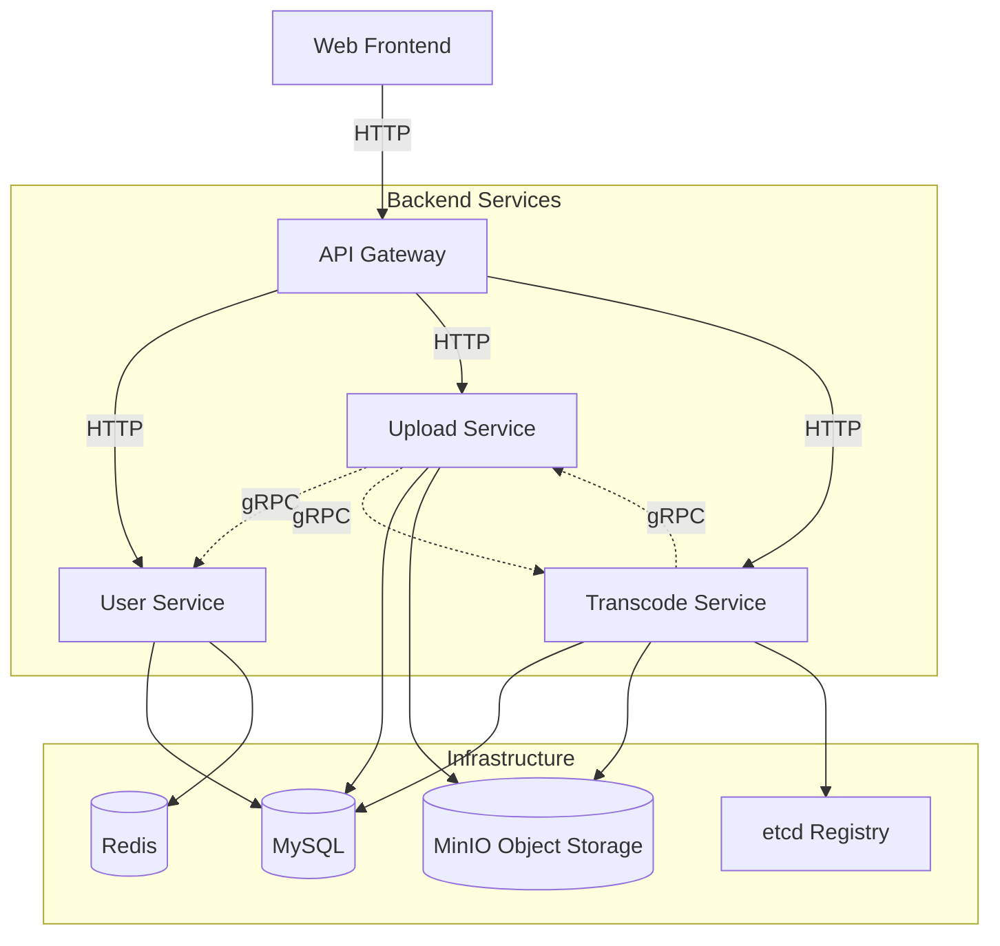

# Go Video Platform

这是一个基于 Go 语言生态构建的现代化视频平台示例项目，采用微服务架构 + DDD（领域驱动设计）思想。项目实现了从用户注册登录、视频分片上传、断点续传、到后台异步转码处理及前端播放的完整业务链路。

## ✨ 功能特性

- **微服务架构**：基于 DDD 设计的三个核心后端服务（用户、上传、转码），职责清晰。
- **高性能上传**：支持大文件分片上传、断点续传、秒传，结合 MinIO 对象存储。
- **视频处理**：内置 FFmpeg 转码工作流，支持多分辨率转码（可降级为模拟模式），支持 HLS 切片。
- **服务治理**：使用 etcd 进行服务注册与发现，gRPC 实现高性能服务间通信。
- **安全机制**：基于 JWT 的用户认证，API 网关统一鉴权。
- **现代化前端**：使用 React 18 + Vite + Ant Design 构建的响应式 Web 界面。

## 🏗 系统架构



### 服务职责
- **Gateway Service (8080)**: 统一流量入口，负责路由转发、CORS 处理、JWT 鉴权。
- **User Service (8081 / gRPC 9091)**: 用户注册、登录、个人信息管理。
- **Upload Service (8082)**: 视频分片上传、合并、元数据发布（视频发布逻辑在此服务中）。
- **Transcode Service (8083 / gRPC 9092)**: 异步视频转码任务调度与执行。

## 🛠 技术栈

- **后端**: Go 1.24+ (Gin, gRPC, GORM, Viper, Wire)
- **数据库/缓存**: MySQL 8.0, Redis 7.0
- **对象存储**: MinIO
- **服务发现**: etcd
- **视频工具**: FFmpeg
- **前端**: React 18, TypeScript, Vite, Ant Design

## 🚀 快速开始

### 1. 环境准备
确保本地已安装以下工具：
- Go 1.24+
- Node.js 18+ & pnpm/npm
- Docker & Docker Compose (推荐用于启动基础设施)
- FFmpeg (可选，若未安装转码服务将运行在模拟模式)

### 2. 启动基础设施
使用 Docker 快速启动 MySQL, Redis, MinIO, etcd：
```bash
# 假设你已有相关的 docker-compose.yml，或者手动启动这些容器
# 示例 etcd 启动命令:
docker run -d --name etcd -p 2379:2379 \
  -e ALLOW_NONE_AUTHENTICATION=yes \
  -e ETCD_ADVERTISE_CLIENT_URLS=http://0.0.0.0:2379 \
  -e ETCD_LISTEN_CLIENT_URLS=http://0.0.0.0:2379 \
  quay.io/coreos/etcd
```

### 3. 初始化数据库
执行初始化脚本创建数据库和表结构：
```bash
mysql -h 127.0.0.1 -P 3306 -u root -p < scripts/mysql/init_all.sql
```
> **注意**: 脚本会创建 `user_service`, `upload_service`, `transcode_service` 等数据库。其中 `upload_service` 库包含了视频发布相关的 `video_publish` 表。

### 4. 配置文件
复制并修改配置文件（参考 `configs/config.dev.yaml`）：
- 确保数据库、Redis、MinIO 的连接信息正确。
- 在 MinIO 中创建 `video-storage` 桶（或配置文件中指定的桶名）。

### 5. 启动后端服务
建议在不同的终端窗口中分别启动：

**Gateway Service**
```bash
cd gateway-service
go mod tidy
go run main.go
```

**User Service**
```bash
cd user-service
go mod tidy
go run main.go
```

**Upload Service**
```bash
cd upload-service
go mod tidy
go run main.go
```

**Transcode Service**
```bash
cd transcode-service
go mod tidy
go run main.go
```

### 6. 启动前端
```bash
cd frontend
npm install
npm run dev
```
访问 `http://localhost:5173` 开始体验。

## 📂 目录结构

```text
.
├── configs/                # 全局配置示例
├── frontend/               # React 前端项目
├── gateway-service/        # API 网关
├── upload-service/         # 上传与视频发布服务
├── user-service/           # 用户服务
├── transcode-service/      # 转码服务
├── proto/                  # gRPC Protobuf 定义
├── scripts/                # 数据库初始化脚本等
└── README.md               # 项目文档
```

## 📝 注意事项
- **Go 版本**: 项目使用了 Go 1.24 的新特性，请确保本地 Go 版本符合要求。
- **FFmpeg**: 转码服务会检查本地是否安装 `ffmpeg`。如果未安装，会自动降级为"模拟转码"模式（仅复制文件并重命名），方便非生产环境开发。
- **服务依赖**: 启动顺序建议为：基础设施 -> User/Upload/Transcode -> Gateway -> Frontend。

## 🤝 贡献
欢迎提交 Issue 和 Pull Request！
