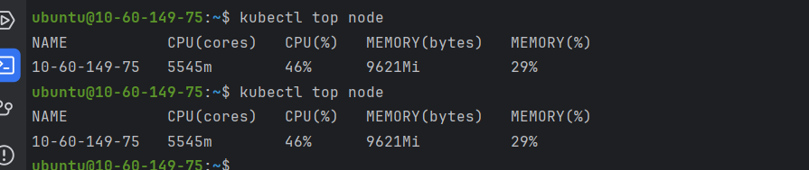

用户关注压测记录（2025-12-11）
=============================

背景
----

- 服务：`user-service` 的「用户关注（Follow）」写入路径。
- 网关入口：Kong NodePort `http://117.50.33.177:30080`。
- 接口：`POST /api/user/v1/inner/relation/follow`，通过网关转发到 `user-service`。
- 目标：模拟大量用户在短时间内关注同一“明星用户”，找到当前配置下系统的承载上限，并记录失败原因。

压测脚本与数据准备
--------------------

- 压测脚本：`loadtest/follow_stress.js`（k6）
  - 使用 `constant-arrival-rate` 模式控制 QPS。
  - 网关地址：默认 `http://117.50.33.177:30080`，可由 `GATEWAY` 环境变量覆盖。
  - 目标用户：通过 open API 注册登录 `star_user_1`，获取其 `user_uuid`，作为 `TARGET_UUID`。
  - 请求体：

    ```json
    { "target_uuid": "<Star user UUID>" }
    ```

  - Header：`Authorization: Bearer <fan access_token>`。
  - 粉丝账号：使用 `loadtest/run_follow_loadtest.sh` / `prepare_fans.ps1` 批量注册 `fan_0001`、`fan_0002`... 等账号，并登录生成 `tokens.txt`（每行一个 access_token）。

- 数据库配置（`user-service/configs/config.dev.yaml` 中）：

  ```yaml
  database:
    max_idle_conns: 10
    max_open_conns: 100
    conn_max_lifetime: 3600s
  ```

  说明：这是 `user-service` 进程内部的连接池设置；MySQL 服务器本身还有一个全局 `max_connections` 限制（默认通常在 151 左右，取决于实际配置）。


测试 1：500 QPS，5 分钟
-----------------------

- 配置（`follow_stress.js`）：

  ```js
  rate: 500,
  duration: '5m',
  ```

- 结果摘要：

  - 总请求数：`http_reqs ≈ 149,922`（约 500 QPS）
  - 失败率：`http_req_failed ≈ 0.00%`（仅 2 次 timeout）
  - 延迟：
    - `avg ≈ 51 ms`
    - `p90 ≈ 62 ms`
    - `p95 ≈ 77 ms`
    - `max ≈ 5 s`（对应个别超时请求）
  - 日志：`user-service` 基本正常，仅偶发 `context canceled`，可视为客户端超时/取消导致。

- 结论：

  - 在当前配置下，**500 QPS 对同一用户的 Follow 写请求可稳定运行 5 分钟**：
    - 成功率接近 100%
    - p95 延迟 < 80 ms
  - 500 QPS 可以作为目前的「安全基线」。


测试 2：1500 QPS，5 分钟
------------------------

- 配置（`follow_stress.js`）：

  ```js
  rate: 1500,
  duration: '5m',
  ```

- 结果摘要：

  - 总请求数：`http_reqs ≈ 420,662`（约 1,400 QPS 实际达成）
  - 失败率：`http_req_failed ≈ 12.53%`（失败请求约 52,713 个）
  - 延迟：
    - `avg ≈ 253 ms`
    - `med ≈ 128 ms`
    - `p90 ≈ 497 ms`
    - `p95 ≈ 936 ms`
    - `max ≈ 5 s`
  - dropped_iterations：`≈ 29,340`，说明在目标 1500 QPS 下，部分请求因系统压力被 k6 丢弃。
  - k6 日志：大量 `request timeout`，即客户端等待 5 秒仍未收到响应。

- `user-service` 日志中的关键错误：

  1）业务层检查目标用户是否存在时的 `context canceled`：

  ```json
  {
    "level": "ERROR",
    "message": "Follow exists is err context canceled",
    "file": "social_controller.go",
    "function": "http.(*socialControllerImpl).Follow"
  }
  ```

  2）关注写入时的数据库错误：

  ```json
  {
    "level": "ERROR",
    "message": "follow upsert user_uuid: ..., target_uuid: ... error: Error 1040: Too many connections",
    "file": "follow_repository.go",
    "function": "persistence.(*followRepositoryImpl).Follow"
  }
  ```

  其中 `Error 1040: Too many connections` 是 MySQL 返回的典型错误，表示服务器当前总连接数已经达到 `max_connections` 上限，新连接被拒绝。


失败原因分析
------------

综合 k6 和服务日志，可以得出：

1. 1500 QPS 下，`user-service` 的 Follow 请求显著增加了对数据库的并发访问：
   - 每个请求都会调用 `userRepo.ExistsByUUID` 检查目标用户是否存在；
   - 然后调用 `followRepo.Follow`，最终通过 `FollowDao.Upsert` 写入/更新 `user_follow` 表。

2. MySQL 端出现 `Error 1040: Too many connections`：
   - 说明 MySQL 全局连接数已经达到 `max_connections` 上限；
   - 新的连接/查询被拒绝，GORM 将该错误返回给应用；
   - `user-service` 记录了 `follow upsert ... error: Error 1040: Too many connections` 的错误日志。

3. 同时，部分请求在执行过程中因为客户端超时或连接中断，导致服务端 `context` 被取消：
   - `social_app.go` 中 `ExistsByUUID` 使用的是带 context 的 GORM 查询；
   - 当上游（k6 或网关）在等待超时后主动断开连接，Gin 会取消请求的 context；
   - GORM 随之返回 `context canceled`，日志中出现 `"Follow exists is err context canceled"`。

4. 对应到 k6 的表现：
   - 约 12.5% 的请求失败，主要原因是：
     - 数据库拒绝连接（`Too many connections`）导致 Follow 写入失败；
     - 请求处理时间超过 k6 设置的 5 秒超时，客户端主动放弃，记录为 `request timeout`。
   - 延迟分布明显恶化（p95 接近 1 秒），说明系统已接近或超过当前配置下的容量上限。

综上，**这次压测在 1500 QPS 时的主要失败原因是：MySQL 连接数达到上限（max_connections），导致 Follow 写入和部分查询失败，从而引发请求超时和错误率上升。**


潜在优化方向
------------

1. 数据库层面
   - 根据机器配置适当提升 MySQL 的 `max_connections`，并确保：
     - MySQL 实例有足够的 CPU / 内存支撑更高并发；
     - 监控连接数、QPS 和慢查询，避免盲目放大。

2. 应用层连接池
   - 根据数据库配置，适当调优 `user-service` 中的：

     ```yaml
     max_open_conns: 100
     max_idle_conns: 10
     ```

   - 避免单个服务进程持有过多闲置连接，同时又不能太小导致频繁建连。

3. Follow 写入路径优化
   - 当前路径：每次 Follow 都是同步检查 + 写入数据库：
     - 检查目标用户是否存在（`ExistsByUUID`）
     - Upsert `user_follow` 记录
   - 可以考虑：
     - 用缓存/本地缓存减少对用户表的存在性检查压力；
     - 对写入做削峰（排队 / 限流）或异步化（消息队列）；
     - 配合批量写/合并写，降低高峰期对 MySQL 的直接冲击。

4. 压测策略
   - 保留本次的 500 QPS / 1500 QPS 结果作为基准：
     - 500 QPS：当前配置下稳定；
     - 1500 QPS：触发 MySQL 连接数瓶颈。
   - 以后做新一轮调优（DB 配置或应用改动）后，可以复用 `loadtest` 脚本，以同样的 QPS 组合重新对比：
     - 是否降低了错误率；
     - 是否改善了延迟分布；
     - 容量上限是否提升。


结论
----

这次压测验证了「同一用户被大量关注」场景下系统的表现：

- 当前配置下，**500 QPS 可以稳定支撑，1500 QPS 会触发数据库连接数上限**；
- 失败的直接原因是 MySQL `max_connections` 被打满，导致 Follow 写入出现 `Error 1040: Too many connections`；
- 这为后续的容量规划、数据库配置调优和关注写入路径优化提供了一个清晰的参考点。

这次事故级别的压测结果是非常宝贵的实践样本，后续所有与关注系统容量相关的改动，建议都以本次记录为基线做对比回归。


补充：10k 唯一关注可靠性压测 & Kafka 消费端
------------------------------------------

在上面的 QPS 压测之外，我们增加了一套「每个账号只关注一次」的场景，用来验证关注事件在

- 网关 → user-service HTTP
- Kafka Producer（`user.follow.events`）
- Kafka Consumer（`FollowEventConsumer`）
- MySQL `user_follow` 表

这一整条链路上**不会静默丢失**。

### 场景设计：10,000 粉丝各 follow 一次

- 新脚本：
  - `loadtest/run_follow_once.sh`（WSL/Linux）
  - `loadtest/run_follow_once.ps1`（Windows PowerShell）
  - `loadtest/follow_once.js`（k6）

- 流程：
  1. 创建/登录明星用户 `star_user_1`，拿到 `STAR_USER_UUID`；
  2. 通过 `prepare_fans.ps1` 创建 `FAN_COUNT = 10000` 个粉丝账号（`fan_0001`~`fan_10000`），并登录生成 `tokens.txt`；
  3. `follow_once.js` 使用 `shared-iterations` 场景：
     - `iterations = tokens.txt 行数`（即粉丝数）；
     - 每个 token 只发送一次：

       ```http
       POST /api/user/v1/inner/relation/follow/toggle
       Authorization: Bearer <fan_token>

       { "target_uuid": "<STAR_USER_UUID>", "action": "follow" }
       ```

     - 不重复关注，同一个 `(fan, star)` 只产生一次 follow 事件。

- 示例执行（Linux/WSL）：

  ```bash
  cd loadtest

  GATEWAY="http://117.50.33.177:30080" \
  STAR_ACCOUNT="star_user_1" \
  STAR_PASSWORD="StarUser123" \
  FAN_COUNT=10000 \
  VUS=300 \
  MAX_DURATION="5m" \
  ./run_follow_once.sh
  ```

### 10k follow-once 压测结果

一次典型执行结果（10,000 粉丝各 follow 一次）：

- k6 输出摘要：
  - `iterations`: 10,000（每个 token 一次）
  - `http_req_failed`: 0.00%
  - `http_req_duration`：
    - avg ≈ 294ms
    - p90 ≈ 522ms
    - p95 ≈ 596ms
    - max ≈ 3.9s

说明在当前配置下：

- 1 万次唯一关注请求在 HTTP 维度全部成功，没有 4xx/5xx；
- 延迟整体在 1 秒以内，个别尾部请求接近 4 秒。

### 验证是否有事件丢失

压测完成、Kafka 消费基本结束后，可以通过以下方式验证是否有事件丢失：

1. 等待 `FollowEventConsumer` 消费完 `user.follow.events`：
   - 在 Kafka UI 中查看对应 consumer group 的 lag 接近 0；
   - 或在 `user-service` 日志中没有新的消费错误出现。

2. 在 MySQL 中统计明星用户的关注数：

   ```sql
   SELECT COUNT(*)
   FROM user_follow
   WHERE target_uuid = '<STAR_USER_UUID>' AND status = 'Following';
   ```

   该 count 理论上应接近 `tokens.txt` 中的 token 数（例如 10,000），误差只可能来自少量注册/登录失败的粉丝账号。

3. 或通过对外接口验证：

   ```text
   GET /api/user/v1/open/users/<STAR_USER_UUID>/relation
   ```

   返回 JSON 中的 `follower_count` 字段应接近上述 count。

### Kafka 消费端实现与优化思路

当前关注事件的消费端位于：

- `user-service/ddd/adapter/component/follow_event_consumer.go`

关键点：

- 启动：

  ```go
  func init() {
      manager.RegisterComponentPlugin(&FollowEventConsumerPlugin{})
  }
  ```

  并在 `user-service/app/app.go` 中通过空导入启用：

  ```go
  import (
      _ "user-service/ddd/adapter/component" // 注册 FollowEventConsumer
      _ "user-service/ddd/adapter/http"
      ...
  )
  ```

- 消费逻辑（当前版本）：
  - `FetchMessage` 单条拉取；
  - `handleMessage` 根据 `op` 调用：

    ```go
    switch op {
    case FollowOpFollow:
        return repo.Follow(ctx, ev.UserUUID, ev.TargetUUID)
    case FollowOpUnfollow:
        return repo.Unfollow(ctx, ev.UserUUID, ev.TargetUUID)
    }
    ```

  - `FollowRepository.Follow/Unfollow` 内部负责：
    - 单条 Upsert / Update `user_follow`；
    - 更新 Redis 计数、列表和边缓存。

优点：

- 实现简单、行为清晰，和现有 DDD 分层契合；
- 每条事件是幂等的，方便重试/补偿。

缺点：

- 完全是「单条消费 + 单条写库」：
  - 每一条 Kafka 消息都对应一次 DB 往返；
  - 当写入量较大、DB/网络略慢时，消费速率会明显落后于生产速率，容易形成 backlog。

#### 优化方向建议

1. **优先使用水平扩展（推荐，零代码改动）**

   - 增加 `user.follow.events` 的分区数（例如从 1 提升到 8 或 16）；
   - 增加 `user-service` 的副本数（例如 `replicas: 3~4`），保持同一个 consumer group。

   Kafka 会自动把不同分区分配给不同实例，每个实例只处理部分分区，从而整体消费吞吐呈近似线性提升。

2. **在需要时再考虑批处理/批量落库（需要改动代码）**

   - 在领域服务中新增批量接口，例如：

     ```go
     ApplyFollowEvents(ctx context.Context, events []*FollowEntity) error
     ```

   - 在 Repo/DAO 中增加 `FollowBatch`、`UnfollowBatch`，使用 `INSERT ... ON DUPLICATE KEY` 等方式进行批量 Upsert；
   - `FollowEventConsumer` 侧改为批量拉取/聚合：
     - 按条数（如 100 条）或时间窗口（如 50ms）触发一次批处理；
     - 统一提交这一批 offset，失败时集中重试。

   这套改造的复杂度和风险都相对较高，建议在「多分区 + 多副本」仍无法满足需求时再考虑。

目前 10k 唯一关注压测下，结合合理的分区数和副本数，现有单条消费模型基本能够满足需求。未来如需进一步提升持续吞吐，可以在此文档基础上继续记录新的压测结果和优化实践。

