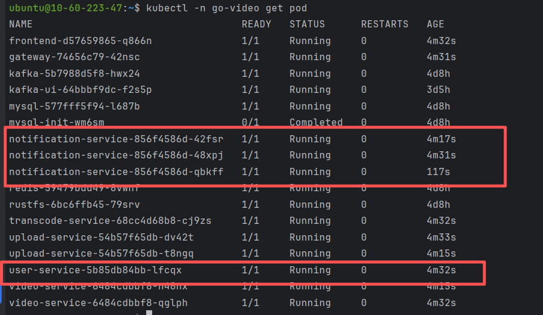
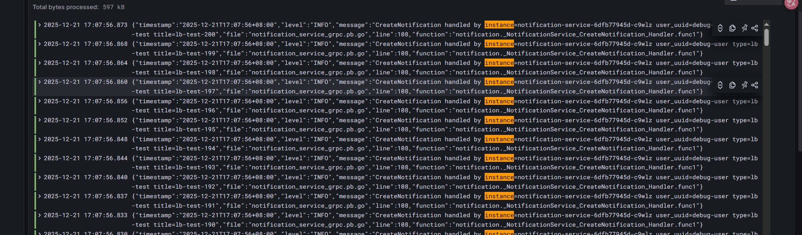
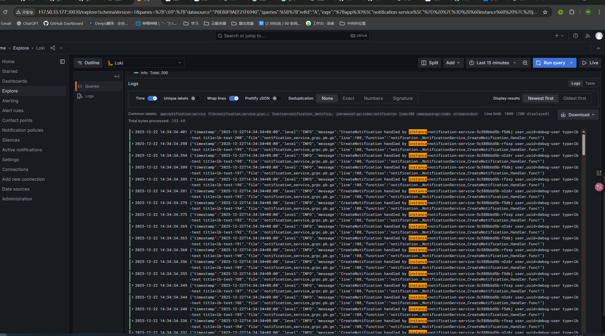

# Kubernetes 环境下 gRPC 负载均衡行为说明

## 1. 背景

在本项目中，各个后端服务（如 `user-service`、`notification-service`、`upload-service` 等）之间通过 gRPC 调用，并部署在 Kubernetes 集群中，通过 ClusterIP `Service` 互相访问。

在调试 user 服务调用 notification 服务的 gRPC 时，我们观察到一个容易误解的现象：

> 即使将 `notification-service` 的副本数扩容到多个，来自同一个 gRPC 客户端实例的大量请求，依然全部落在同一个 Pod 上，而不是在多个 Pod 上“轮询分摊”。

本文档说明：这是 **Kubernetes + gRPC 的正常行为**，并解释原因和影响。

---

## 2. 结论先行

在 Kubernetes 中，通过 `Service` 访问 gRPC 服务时：

- **Kubernetes 的负载均衡单位是“连接（Connection）”，不是“请求（Request/RPC）”**；
- gRPC 基于 HTTP/2，默认使用长连接，一个 client 实例通常只维护少量连接；
- 因此：

> 单个 gRPC 客户端实例发出的所有请求，大概率会“粘”在某一个后端 Pod 上，而不会每个请求都轮询到不同 Pod。

换句话说：

> 在 K8s 环境下，gRPC 无法仅依靠 ClusterIP `Service` 实现“请求级负载均衡”，只能实现“连接级负载均衡”。

如果需要更细粒度的请求调度，需要引入客户端负载均衡、服务网格（Envoy / Istio / Linkerd）等额外机制。

---

## 3. Kubernetes Service 的负载均衡行为

### 3.1 负载均衡发生在 TCP 连接层

Kubernetes 的 `Service`（ClusterIP / NodePort）本质上是通过 iptables 或 IPVS 对访问 **Service IP:Port** 的流量进行 DNAT，将其转发到某个后端 Pod：

- 当客户端第一次向 `notification-service:9095` 建立 TCP 连接时，kube-proxy 按配置的算法（如 round-robin）选择一个后端 Pod（比如 `notification-service-xxx-abc`）；
- **在这个 TCP 连接的整个生命周期内，流量都固定发往同一个 Pod**；
- 只有**新建 TCP 连接**时，才会重新决定这条连接应该转发到哪个 Pod。

因此：

- Service 实际做的是 **“连接级负载均衡”**；
- Service **不会**针对同一条 TCP 连接上的每一个 HTTP/gRPC 请求重新选择 Pod。

### 3.2 多个连接才会分配到多个 Pod

如果客户端创建了多条 TCP 连接：

- 每条连接在建立时，由 kube-proxy 独立地选择一个 Pod；
- 这些连接一般会比较均匀地分配到多个 Pod 上；
- 但 **每条连接上的所有请求依然固定落在对应 Pod，不会在请求层面再做调度**。

这点对 HTTP/1.1、HTTP/2、gRPC 都成立，区别只是每条连接上承载的请求数量和方式不同。

---

## 4. gRPC 的长连接与多路复用

gRPC 基于 HTTP/2，有几个重要特性：

- **长连接**：默认使用持久连接（Keep-Alive），不会为每个 RPC 建立新 TCP 连接；
- **多路复用**：一个 HTTP/2 连接上可以同时承载多个并发的 gRPC 流（streams）；
- **连接池（可选）**：一些 gRPC 客户端实现会维护少量连接池，但默认情况下，一个客户端进程往往只创建 1 条或几条连接。

结合 Kubernetes Service 的行为：

- 一个 gRPC 客户端实例通常只打开 1 条到 `notification-service:9095` 的 TCP 连接；
- 这条连接在建立时被 kube-proxy 绑定到某个 Pod；
- 之后这个 client 的所有 gRPC 请求，都复用这条连接发送；
- 于是这些请求全部落在同一个 Pod 上。

这就是我们在实验中看到的现象：  
**单个 `user-service` 实例连续调用很多次 gRPC，全部被同一个 `notification-service` Pod 处理。**

---

## 5. 两层行为叠加后的效果

综合上面两点：

1. **K8s Service：按连接负载均衡**  
   每条 TCP 连接被分配到一个具体 Pod 上，在连接存活期间不会改变。

2. **gRPC：按连接复用请求**  
   一个客户端实例建立少量长连接，所有 RPC 默认复用这些连接。

叠加结果就是：

- “连接数” 决定能被分摊到多少后端 Pod；
- “每条连接” 对应一个 Pod，连接上的所有请求都粘在该 Pod；
- 所以：
  - **单 client + 单连接** → 请求都落在一个 Pod；  
  - **多 client / 多连接** → 各连接被分配到不同 Pod，每个连接上的请求依然粘在自己的 Pod 上。

这就是为什么在 K8s 环境下，我们只能得到 **连接级负载均衡**，而不是“每个 gRPC 请求轮询一次”的负载均衡。

---

## 6. 项目中的验证方式（简述）

在本仓库中，我们专门做了一个实验来验证上述行为（以 user → notification 为例）：

- 场景：
  - `user-service` 副本数 = 1；
  - `notification-service` 副本数 = 3；
- 改动：
  - 在 `notification-service` 的 gRPC 处理函数中打印当前 Pod 的 hostname：
    ```go
    hostname, err := os.Hostname()
    if err != nil {
        hostname = "unknown"
    }
    logger.WithContext(ctx).Infof(
        "CreateNotification handled by instance=%s user_uuid=%s type=%s title=%s",
        hostname, req.GetUserUuid(), req.GetType(), req.GetTitle(),
    )
    ```
  - 在 `user-service` 中增加一个调试 HTTP 接口，内部循环调用 `NotificationService.CreateNotification`，模拟大量 gRPC 请求。
- 结果：
  - 多条日志中 `instance=` 字段始终是同一个 Pod 名；
  - 即使 `notification-service` 有多个副本，来自这 1 个 `user-service` 实例的请求还是全部打在同一个 Pod 上。

如果扩容 `user-service` 副本为 3：

- 各个 `user-service` Pod 会各自建立到 `notification-service` 的连接；
- 这些连接会被 K8s Service 分配到不同 `notification-service` Pod；
- 日志中可以看到不同 `instance=` 值出现，但**每个 client 自己仍然粘在某个 Pod 上**。






---

## 7. 如果需要“请求级负载均衡”，该怎么做？

如果业务确实希望**每个 gRPC 请求**都有机会被不同 Pod 处理，而不是粘在单个 Pod 上，单靠 Kubernetes Service 不够，需要额外的机制，例如：

### 7.1 客户端负载均衡（Client-side LB）

- 不直接把 gRPC client 指向 Service IP，而是从服务发现（etcd / Consul / Headless Service / 自建 registry 等）拿到多个 Pod 地址；
- 使用 gRPC 的客户端负载均衡策略（如 `round_robin`），在客户端内部对不同后端地址/连接做调度；
- 每个 RPC 由客户端选择目标连接，从而实现更细粒度的分布。

### 7.2 服务网格 / Sidecar（Envoy / Istio / Linkerd 等）

- 在应用 Pod 旁边部署 sidecar（Envoy 等）；
- 业务代码只连到本地 sidecar，由 sidecar 维护到后端 Pod 的多个连接并做请求级路由；
- 这类网格通常能够对 HTTP/2/gRPC 做更细粒度的负载均衡，并支持熔断、重试等高级特性。

### 7.3 增加连接数并在应用层分发

- 在客户端进程中主动建立多条到 Service 的 gRPC 连接（而不是只有 1 条）；
- 自行实现“按请求选择连接”的策略；
- 这样虽然底层仍然是“连接级 LB”，但从应用视角看，多个连接 + 多个 Pod 的组合可以近似达到请求级分摊。

---

## 8. 总结

- Kubernetes Service 是以 **TCP 连接** 为单位做负载均衡，不会对同一连接上的每个请求重新选择后端；
- gRPC 基于 HTTP/2，**默认使用长连接并复用连接发送多个 RPC**；
- 这两点叠加的结果是：

> 在 K8s 环境下，gRPC 默认只能做到“连接级负载均衡”，无法（仅依靠 Service）实现“请求级负载均衡”。

如果需要请求级行为，需要引入：

- 客户端负载均衡；
- 服务网格 / sidecar；
- 或者在应用层自行管理多连接与分发策略。

这一行为是 gRPC 与 Kubernetes 的正常组合特性，并非配置错误或实现 bug，需要在系统设计和容量预估时明确预期。

---

## 9. 本项目的实践：使用 kuberesolver 做客户端负载均衡

我们在 `user-service` 调用 `notification-service` 时启用了客户端 LB，依赖开源库 [github.com/sercand/kuberesolver](https://github.com/sercand/kuberesolver)。

### 9.1 方案要点

- 通过 kuberesolver 直接 watch Kubernetes EndpointSlice，获取所有就绪 Pod 的地址；
- 在 `grpc.Dial` 启用 `round_robin`，让 gRPC 客户端在多个地址间轮询建连和发送请求；
- 仍然使用 gRPC 原生客户端，无需额外 sidecar。

### 9.2 代码改动（示例）

- 地址使用 `kubernetes:///notification-service:9095`，触发 kuberesolver：  
  `user-service/ddd/infrastructure/grpc/notification_service_client.go`  
  - 注册 resolver：`kuberesolver.RegisterInCluster()`（首个拨号时）  
  - 启用 `round_robin`：`grpc.WithDefaultServiceConfig('{"loadBalancingConfig":[{"round_robin":{}}]}')`

### 9.3 RBAC 要求

kuberesolver 需要读取 EndpointSlice/Endpoints；在 `go-video` 命名空间下增加最小权限：  
`k8s/apps/user-service/user-service-rbac.yaml`

```yaml
apiVersion: rbac.authorization.k8s.io/v1
kind: Role
metadata:
  name: user-service-kuberesolver
  namespace: go-video
rules:
  - apiGroups: ["discovery.k8s.io"]
    resources: ["endpointslices"]
    verbs: ["get", "list", "watch"]
  - apiGroups: [""]
    resources: ["endpoints"]
    verbs: ["get", "list", "watch"]
---
kind: RoleBinding
apiVersion: rbac.authorization.k8s.io/v1
metadata:
  name: user-service-kuberesolver
  namespace: go-video
subjects:
  - kind: ServiceAccount
    name: default # 如 Deployment 指定了 serviceAccountName，这里需同步
    namespace: go-video
roleRef:
  apiGroup: rbac.authorization.k8s.io
  kind: Role
  name: user-service-kuberesolver
```

### 9.4 验证步骤

1) 应用 RBAC：`kubectl apply -f k8s/apps/user-service/user-service-rbac.yaml`  
2) 部署更新的 `user-service` 镜像。  
3) 集群内压测调试接口：  
   `kubectl -n go-video run -it curl --rm --restart=Never --image=curlimages/curl -- sh`  
   `curl "http://user-service:8081/debug/user/v1/debug/notification-grpc-lb?count=200"`  
4) 查看 `notification-service` 多个 Pod 日志，确认请求分布在不同实例。
