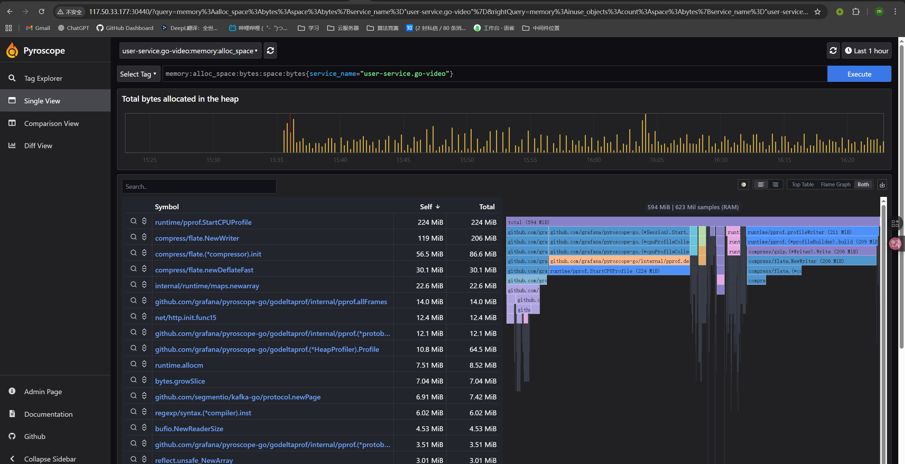
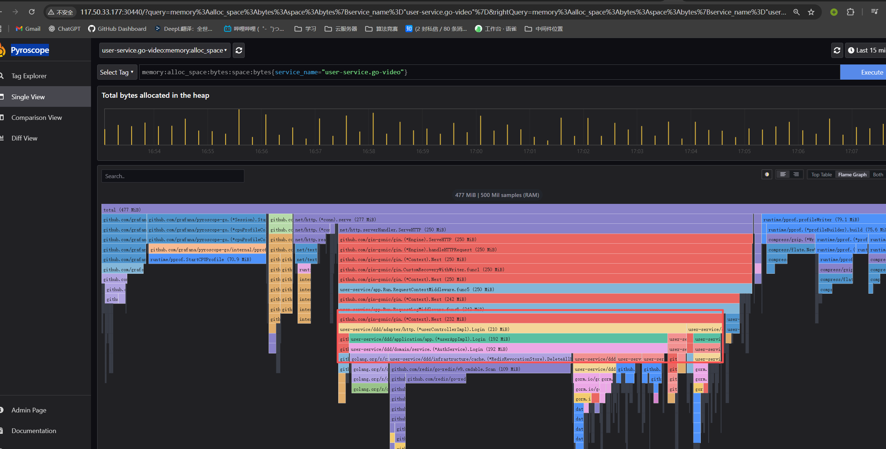

# 持续 Profiling 与 Pyroscope 视图说明

本文档介绍本项目中通过 Pyroscope / Grafana Profiles 做持续 Profiling 的用法，重点说明在 UI 上看到的几类指标名字（`memory:inuse_space` 等）分别代表什么含义、适合用来解决什么问题。

---

## 1. 整体架构回顾

在 go-video 中，CPU / 内存 Profile 的采集与展示大致链路如下：

> Go 服务（user / upload / transcode）  
> ➜ 通过 `pyroscope-go` SDK 采样 Profile  
> ➜ 上报到 `observability` 命名空间里的 `pyroscope` 服务  
> ➜ 在 Pyroscope UI 或 Grafana Profiles 里查看火焰图 / 表格

三个服务在入口都调用了统一的 Profiling 初始化：

- `user-service/main.go` 调用 `observability.StartProfiling("user-service")`
- `upload-service/main.go` 调用 `observability.StartProfiling("upload-service")`
- `transcode-service/main.go` 调用 `observability.StartProfiling("transcode-service")`

具体实现见：

- `user-service/pkg/observability/profiling.go`
- `upload-service/pkg/observability/profiling.go`
- `transcode-service/pkg/observability/profiling.go`

通过环境变量控制：

- `PROFILE_ENABLED`：`1/true/yes` 时开启持续 Profiling
- `PROFILE_SERVER`：Pyroscope 地址，例如 `http://pyroscope.observability.svc.cluster.local:4040`
- `PROFILE_ENV`：环境标签（`dev` / `perf` / `prod` 等），用于区分不同环境数据

---

## 2. Pyroscope UI 里的「应用」与「Profile 类型」

打开 Pyroscope Web（默认 NodePort：`http://<节点IP>:30440`）后，在左侧可以看到类似：

- `user-service.go-video`
- `upload-service.go-video`
- `transcode-service.go-video`

这些是不同的「应用」（Application）：

- 名字来源是 `StartProfiling("xxx-service")` 时配置的 `ApplicationName`
- 每个应用下会包含多种不同类型的 Profile（内存 / CPU）

点开某个应用后，会看到几行形如：

- `memory:alloc_objects`
- `memory:alloc_space`
- `memory:inuse_objects`
- `memory:inuse_space`
- `process_cpu:cpu`
- `process_cpu:samples`

下面重点解释这几种 Profile 的含义与使用场景。

---

## 3. 内存相关 Profile 类型

在排查「哪块代码占内存多」「是否有内存泄漏」时，主要关注 `memory:*` 这四种。

### 3.1 memory:inuse_space

- **含义**：当前仍然存活（尚未被 GC 回收）的堆内存总量，按「在哪个函数分配」聚合后画火焰图。单位通常显示为 MiB。
- 可以理解为：「这一刻谁在占着内存」。  
- 使用建议：
  - 选择压测后期一段时间（内存涨起来之后）；
  - 看火焰图中最宽的那条调用链是哪些函数 / 包；
  - 适合用来定位缓慢泄漏、缓存占用过大、某些 slice / map 长期占用内存等问题。

### 3.2 memory:inuse_objects

- **含义**：当前仍然存活的对象数量（object count），同样是按分配位置聚合的。
- 使用建议：
  - 与 `inuse_space` 搭配观察：
    - 如果对象数量非常多但总内存不算离谱，多半是「很多小对象」；
    - 如果对象数量不多但占用空间大，则是「少量大对象」。

### 3.3 memory:alloc_space

- **含义**：在某段时间范围内，累计分配过的堆内存总量（包括后来已经被 GC 回收的）；可以理解为「这段时间，一共 new / 分配了多少内存」。  
- 使用建议：
  - 用来找「分配热点」，即使 GC 已经回收了，也会放大 GC 压力、拖慢系统；
  - 适合分析：
    - 高频 JSON 编解码、数据拷贝、临时 slice / map 创建；
    - 反复创建临时大对象的地方。

### 3.4 memory:alloc_objects

- **含义**：在时间范围内累计分配过的对象个数。
- 使用建议：
  - 配合 `alloc_space` 使用：
    - `alloc_objects` 很多但 `alloc_space` 不算大：大量小对象频繁分配，可能需要优化数据结构或复用；
    - 两者都很高：既数量多又体积大，是内存压力和 GC 压力双高的代码路径。

> 小结：
>
> - `inuse_*` 系列：看「**现在仍在占用的**」内存 / 对象 —— 用于发现泄漏、常驻内存占用。
> - `alloc_*` 系列：看「**历史分配过的**」内存 / 对象 —— 用于发现高分配热点、GC 压力来源。

---

## 4. CPU 相关 Profile 类型

在定位「哪个函数最吃 CPU」时，主要看 `process_cpu:*`。

### 4.1 process_cpu:cpu

- **含义**：按照 CPU 时间聚合的火焰图，横向宽度代表某段调用栈消耗的 CPU 时间占比。
- 使用建议：
  - 压测期间选一段时间窗口，查看：
    - 哪些 handler / gRPC 方法 / DAO 调用占据了大部分 CPU；
    - 是否存在异常的忙等循环、过多的序列化 / 反序列化等。
  - 用于指导：
    - 是否需要缓存、减少重复计算；
    - 是否要优化 SQL / IO 调用，避免 CPU 大量阻塞在用户态逻辑。

### 4.2 process_cpu:samples

- **含义**：记录 CPU 采样点的「样本数量」，通常与 `process_cpu:cpu` 搭配使用。
- 一般直接使用 `process_cpu:cpu` 就够了，`samples` 更多是内部统计用指标。

---

## 5. 常见分析套路示例

下面是几个在 go-video 压测 / 排查中比较实用的组合。

### 5.1 看某个服务「现在内存都去哪了」

1. 在 Pyroscope 或 Grafana Profiles 中选择：
   - Application：例如 `upload-service.go-video`
   - Profile type：`memory:inuse_space`
   - 时间范围：压测后半段（例如最近 10 分钟）
2. 在火焰图中：
   - 找出最宽的几条栈；
   - 鼠标悬停，记下涉及的包 / 函数名；
   - 对比代码，看是否存在无界缓存、未释放的列表 / map、过大的结果集等。

### 5.2 看「哪些代码最喜欢 new 对象」

1. 选择 Profile type：`memory:alloc_space` 或 `memory:alloc_objects`；
2. 时间范围覆盖一段完整压测（例如 30 分钟）；
3. 分析：
   - 高频率分配的热点函数是否可以：
     - 复用 buffer（例如 `sync.Pool`）；
     - 减少中间结构拷贝；
     - 减少不必要的 JSON/Protobuf 编解码。

### 5.3 看「CPU 热点」

1. 选择 Profile type：`process_cpu:cpu`；
2. 时间范围覆盖高 QPS 时段；
3. 分析：
   - 找到 CPU 占比最高的几个函数 / 调用链；
   - 判断是纯计算密集，还是 JSON 编码 / 数据格式转换 / 业务逻辑遍历过多；
   - 结合 Prometheus 的 QPS/RT 指标，评估是否要拆分、缓存或者异步化。

---

## 6. 推荐使用方式与注意事项

1. **只在需要的环境和实例上开启 Profiling**  
   - 通过 `PROFILE_ENABLED=1` 控制；
   - 可以只在压测环境或生产的部分实例上打开，以降低开销。

2. **压测时配合 Prometheus 指标使用**  
   - 内存：`go_memstats_heap_inuse_bytes`、`go_memstats_heap_objects`；  
   - GC：`go_gc_duration_seconds`；  
   - 再结合 Pyroscope 的 `memory:inuse_space` / `alloc_space`，既看「量级」，也看「谁导致的」。

3. **注意时间窗口的一致性**  
   - 在 Grafana 中分析时，建议 Dashboard 的时间范围与 Pyroscope / Profiles 视图保持一致，方便对齐 QPS / RT / 内存 / 火焰图。

4. **逐步定位，而不是一次找完所有问题**  
   - 先选一个服务（例如 `upload-service`）；  
   - 先搞清楚内存 / CPU 的头部热点；  
   - 优化完一处，再做下一轮压测与 Profiling，对比前后数据变化。

通过上述 Profile 类型和分析套路，你可以在压测和生产环境中逐步构建对系统「CPU / 内存」行为的直觉，快速定位热点与异常路径，实现更有针对性的性能优化与容量规划。

